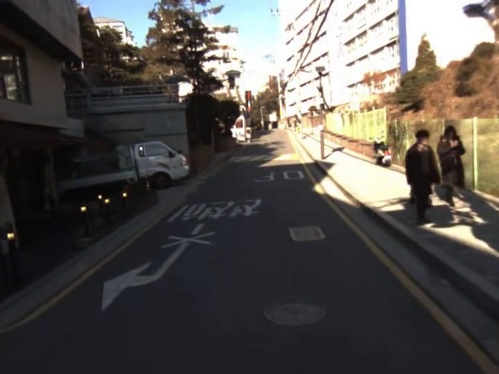
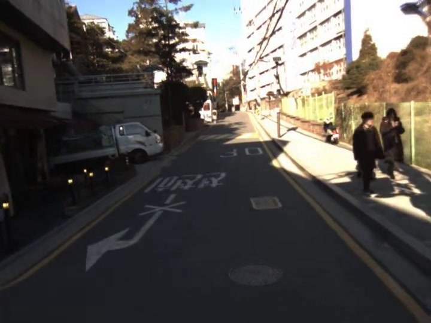
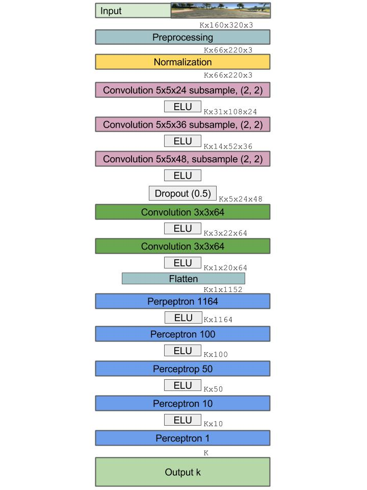
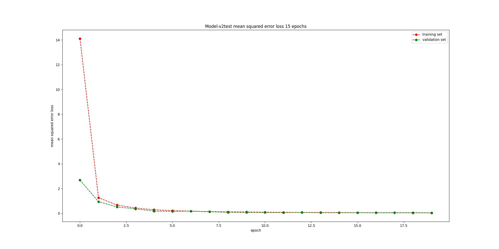

# Speed Prediction

## Description
This my personal project on Machine Learning and Computer Vision. The task is to predict the speed of the car from video(sequence of frames). Data was taken from [here](https://github.com/marsauto/marschallenge)

## Data Preparation
I have downloaded video from link above and converted video to frames by OpenCV. So now it is a time to think how can I approach the problem. One way to solve this problem and which I chose is to get Optical Flow between two consecutive frames. Thus network can be trained on that Flow Image and given speed label.   

At first, frames were cropped and resized to (220,66) pixels, because this is the input shape to my neural network. Then brightness of each frame is changed and optical flow image of two consecutive frames is calculated by prebuilt function in OpenCV.   

These are original frames.   
 


These are images after being cropped and resized.    
 

This is the Optical Flow between two images above
<p align="center">
    
</p>

## Training
```
python3 train.py
```
For this task I have chosen Nvidia_CNN model which architecture looks as below. ELU and MSE are used as Activation function and Loss functiion respectively.
<p align="center">
    
</p>
I have have trained for 20 epochs and with batch size = 1. This is how my model improved through training process
<p align="center">
    
</p>

## Testing
```
python3 test.py
```
As I have been told my MSE on test data is 3.75. Here is a short [video](https://www.youtube.com/watch?v=GZHlWl803Pw) with prediction on test data. 
<p align="center">
    
</p>

## Requirements
* Tensorflow 1.12.0
* Keras 2.2.4
* OpenCV 3.2.0
* Numpy 1.18.1
* Matplotlib 3.2.0